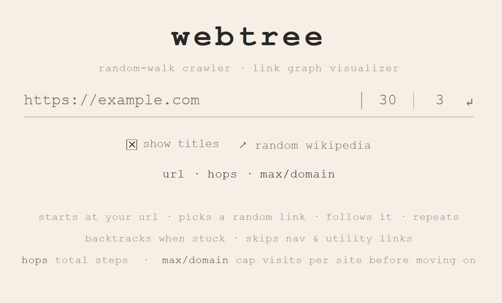
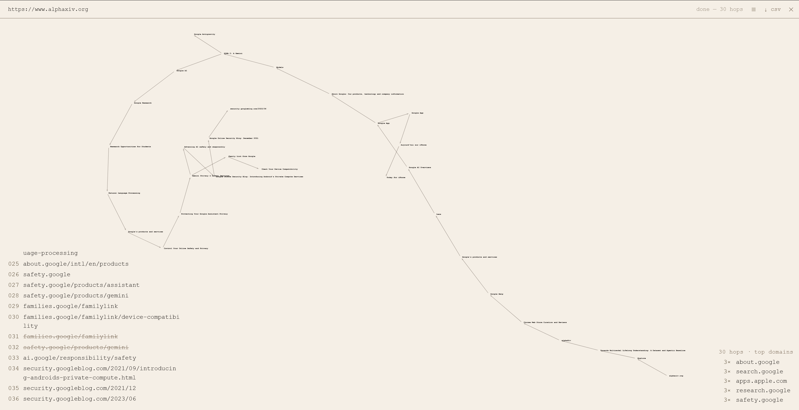

# webtree — Random Walk Web Crawler

This project was inspired by the book 'An Introduction to Complex Systems: Making Sense of a Changing World', by Joe Tranquillo, Pr at Bucknell University.

webtree is a visual web crawler that performs a random walk across the internet, starting from any URL you provide. It follows links at random, backtracks when stuck, and builds a real-time force-directed graph of every page it visits, revealing the hidden structure of how websites connect to one another.

The web is a complex system. Like a neural network, an ant colony, or a social graph, it has no central authority, yet global structure emerges from billions of local connections. webtree is a small instrument for exploring that structure: not by indexing or ranking, but by wandering, one link at a time, and watching where chance takes you. It's serendipity-like.

## How it works
- **Random navigation** — at each step, the bot picks a random link from the current page and follows it.
- **Domain cap** — once a domain has been visited too many times, its links are filtered out, forcing the walk to jump elsewhere.
- **Backtracking** — if the bot reaches a dead end (no unvisited, eligible links), it steps back to the previous page. Backtracks are shown as dashed edges in the graph.
- **Link filtering** — navigation links, utility pages (privacy, contact, login…), and pagination are ignored in favor of content-like links.

## Parameters
| Parameter | Description |
|---|---|
| `hops` | Total number of steps the bot takes (1–100) |
| `max/domain` | Max visits allowed per domain before moving on (1–50) |

## Screenshots

